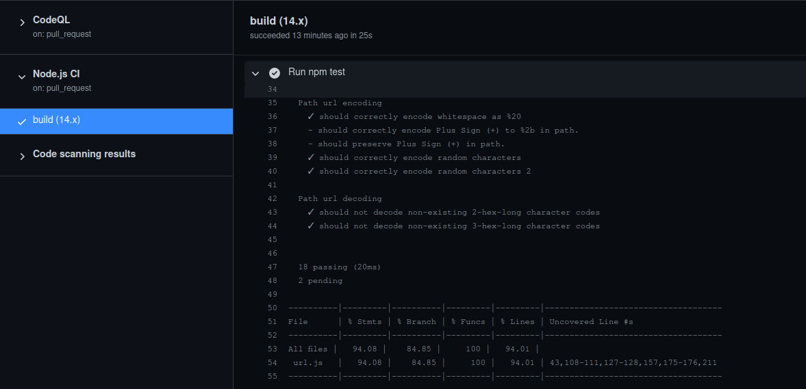

# Github Actions dokumentáció

## Cél
A cél determinálása során arra jutottunk, hogy az actions legmegfelelőbb használata az lenne, ha minden féle tesztet lefuttatnánk a main ágra érkező commitokon, és a main ágra irányuló pull requesteken. Ezzel tudjuk garantálni, hogy olyan munka ne kerüljön a main ágra ami a tesztek alapján nem megfelelően funkcionál.

## Beüzemelés
A célra teljesen megfelelt a NodeJS minta workflow. Mivel a 14.x long term support verziót használtuk mindannyian, arra állítottam be a futtatást.

### A futtatandó lépések:

- Installálom a project Node package dependenciáit a `npm install` parancs használatával.
- Elkészítem a minify-d verziót a code-ból, mivel ez afféle "build" lépés a projectünkben.
- Futtatom a MochaJS segítségével készített teszteket.
- Futattom a CucumberJS segítségével készített BDD teszteket.

## Végeredmény
Az action sikeresen fut minden egyes pull requestünknél, ezzel is elősegítve a jobb minőségű kódbázist.

