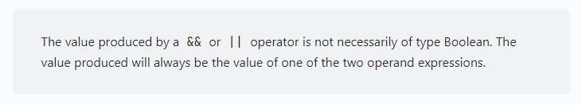

## Statikus analízis dokumentáció

# SonarLint
A statikus analízist a gyakorlaton látott SonarLint segítségével végeztük el lokálisan, mely a következő két hibát találta:

`Identical expressions should not be used on both sides of a binary operator (javascript:S1764)`

A hibát próbáltuk javítani a SonarLint által javasolt módon, ám további megbeszélések után arra jutottunk, hogy ez egy szándékosan bevezetett viselkedés, így reverteltük a változtatásokat.

Forrás: https://mariusschulz.com/blog/the-and-and-or-operators-in-javascript

Tehát Javascriptben a && és || operátorok nem feltétlenül boolean értéket adnak vissza. Mindig az egyik oldalon álló kifejezés értéke lesz az eredmény.

A && operátor a bal oldalon álló tagot adja vissza, ha az hamis, egyébként pedig a jobb oldalit.

A || ezzel szemben a bal oldalt akkor adja vissza, ha igaz, ellenkező esetben az eredmény a jobb oldal lesz.
