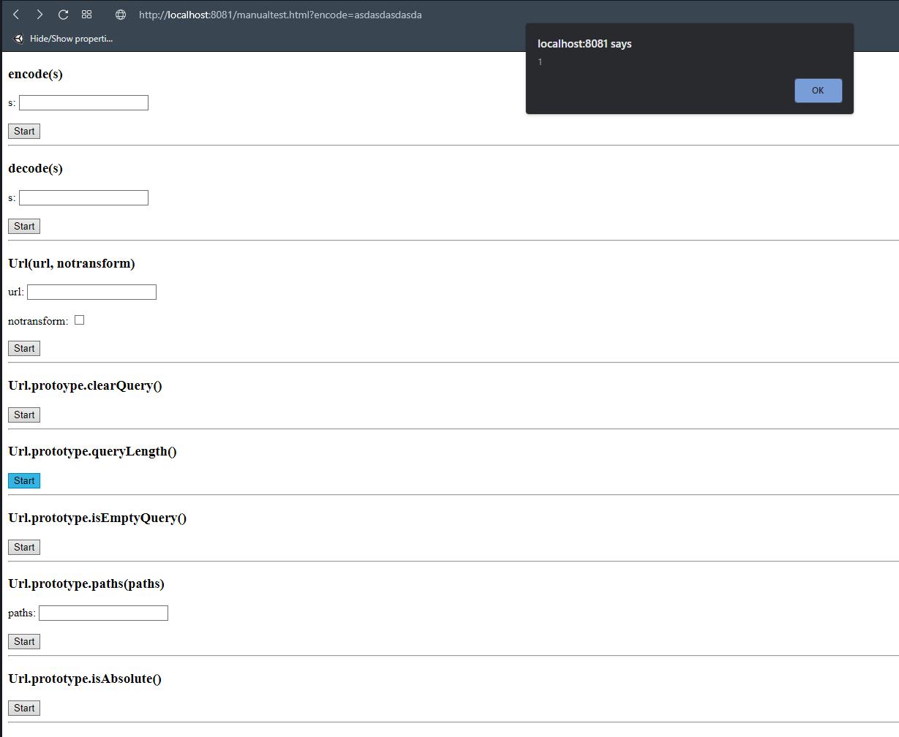

# Manual testing dokumentáció

## felállítás

A tesztelendő program vizsgálata után előkészítettem a manuális teszteléshez felhasznált környezetet.
Ez egy egyszerű html és a gombok funkcionalitását megvalósító js fájlból áll.

## beüzemelés

A tesztelési fázis elején a dockert használtam, mint futtatókörnyezet, de ez nagyon sok helyet foglalt, és lassú is volt,
úgyhogy váltottam http szerver futtatására commandlineban.

## tesztelés

Az elkészített html oldalon az adott funkciókat lehet tesztelni, paramétereket a textboxban megadva,
a teszt eredményét pedig alertként kapjuk meg.

